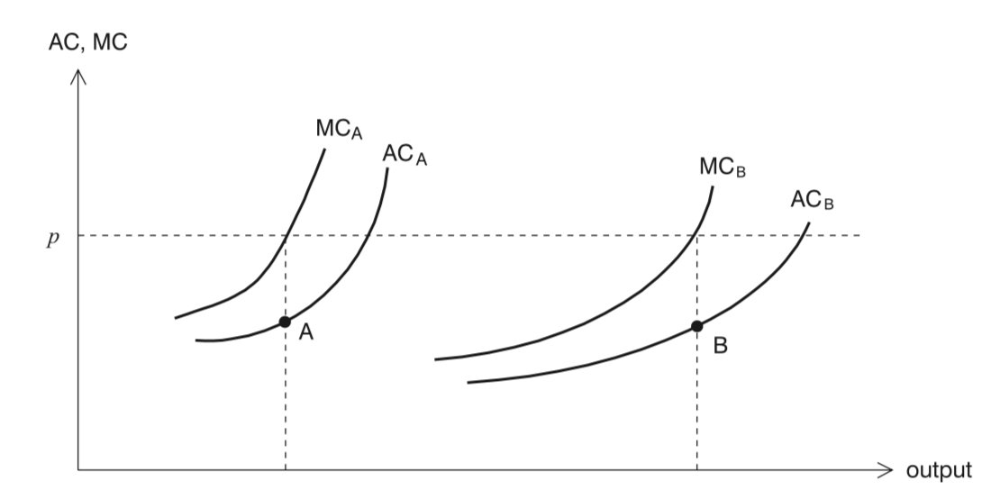
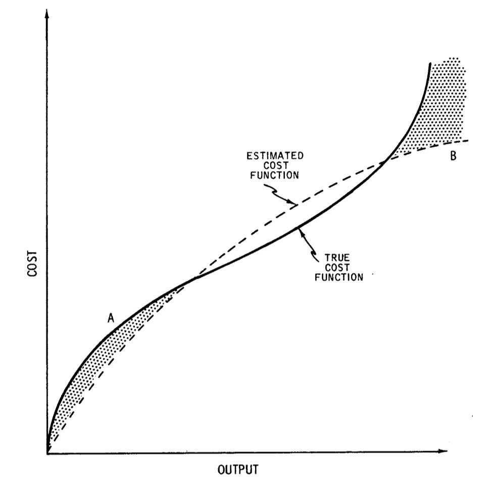

```{r setup, include=FALSE}
knitr::opts_chunk$set(
  echo       = TRUE,
  message    = FALSE,
  warning    = FALSE,
  fig.align  = "center",
  fig.width  = 8,
  fig.height = 5
)
```

# Librerías

Para este análisis utilizamos las siguientes librerías de R:

```{r librerias}
# Instalación (descomentar si es necesario):
# install.packages(c("haven", "tidyverse", "stargazer", "car", "knitr", "kableExtra"))

library(haven)       # Leer archivos .dta (Stata)
library(tidyverse)   # Manipulación de datos y gráficos (dplyr, ggplot2, etc.)
library(stargazer)   # Tablas de regresión
library(car)         # Pruebas de hipótesis lineales (linearHypothesis)
library(knitr)       # Tablas y formato
library(kableExtra)  # Formato adicional para tablas
```

# Aplicación del Método de MCO: Retornos a Escala en la Industria Eléctrica

## Contexto

Esta aplicación tiene su origen en el trabajo de **Nerlove (1963)**. Este es un estudio clásico de los retornos a escala en una industria regulada. Nerlove ofreció una buena descripción de la industria eléctrica, dicha descripción es válida para el momento en que se escribió:

- Los oferentes/generadores de electricidad son monopolios locales privados.
- Las tarifas o precios minoristas de la electricidad son establecidos por un ente regulador.
- Los precios de los factores productivos están dados y no son modificables por las empresas en el corto plazo, ya que existen diversos contratos de largo plazo (por ejemplo, los contratos laborales) — i.e., todas las empresas son tomadoras de precios.

Respecto de los datos, estos consisten en **145 empresas** ubicadas en 44 estados en EUA en el año 1955, ya que son para los únicos estados para los que existe información. El estudio utilizó información de aproximadamente el 80% de la electricidad producida.

Visto por la forma de producción, Nerlove identificó que existían 3 métodos de producción de electricidad:

- Motores de combustión interna.
- Hidroeléctricas.
- Termoeléctricas.

Al respecto, Nerlove muestra que en los 50's cerca del 70% de la electricidad era producida por las empresas termoeléctricas. El combustible principal empleado en dichas termoeléctricas era carbón (66.4%), seguido de petróleo (14.5%) y gasolina (19.1%).

## Variables

Las variables consideradas son: costos totales, precios de los factores (salarios, precios de combustibles, renta o precio del capital), y el producto. Aunque las empresas son dueñas del capital, en el modelo se supone que dichas empresas se comportan como si estas pagaran una renta de capital, por lo que se imputa un precio por el costo de capital.

No obstante, para mayores detalles refiérase al documento original de Nerlove, donde se describe con mayor detalle la forma en que fue construida la base de datos. Los datos de producción, combustibles y costos laborales fueron obtenidos de la Federal Power Commission (1956).

## Motivación económica

La motivación para el análisis es que mediante un enfoque econométrico se puede construir una curva de costo promedio (AC, por sus siglas en inglés) para cada empresa, misma que es diferente de la promedio de la industria. Esto es, las empresas enfrentan diferentes precios por los factores productivos y por lo tanto diferentes costos totales, medios y marginales.

Para enfocarnos en la conexión entre la eficiencia de producción y el producto, asumimos que todas las empresas enfrentan más o menos los mismos precios de los factores, y la única razón por la que las curvas de costo medio (AC) y de costo marginal (MC) difieren entre las empresas es la diferencia en la eficiencia productiva. Las curvas de AC y de MC tienen pendiente positiva para reflejar retornos a escala decrecientes.

Si vemos la siguiente Figura, las curvas de AC y MC de la empresa A están a la izquierda de las de la empresa B porque la empresa A es menos eficiente que B. Esto es derivado de que la industria es competida, ambas empresas enfrentan el mismo precio $p$. Dado que la cantidad está determinada por la intersección de MC y el precio de mercado, las combinaciones de cantidad / producto y el AC para las dos empresas se ilustra en la Figura.

```{r fig-hayashi, echo=FALSE, out.width="70%", fig.cap="Curvas de AC y MC para dos empresas (Hayashi, p. 62)"}

```

De esta forma, la curva que resulta de conectar los puntos A y B puede tener una pendiente negativa, dando la impresión de un escenario de rendimientos crecientes a escala en la industria, ya que la agregación de todos los puntos de las empresas individuales conformarán la curva de costos promedio de la industria.

## Modelo

La parametrización de la función de costos parte de una función de producción del tipo Cobb-Douglas:

$$Q_i = A_i \, x^{\alpha_1}_{i1} \, x^{\alpha_2}_{i2} \, x^{\alpha_3}_{i3}$$

Donde $Q_i$ es la producción de la empresa $i$, $x_{i1}$ es el insumo de trabajo, $x_{i2}$ es el insumo capital, y $x_{i3}$ es el insumo de combustible. El término $A_i$ captura las diferencias no observables en la eficiencia de producción (heterogeneidad de las empresas).

La suma de los parámetros: $\alpha_1 + \alpha_2 + \alpha_3 = r$ indica el grado de retornos a escala. Asumimos que el grado de retornos a escala es constante (esto no significa que existen retornos a escala constantes, ya que para ello se debería cumplir que $r = 1$).

El problema que cada empresa enfrenta es el de minimizar sus costos de producción, sujeto a la cantidad producida:

$$\min_{x_{i1}, \ldots, x_{iK}} \sum_{k = 1}^{K} p_{ik}x_{ik}$$
$$\text{s.a.} \quad Q_i = f(x_{i1}, \ldots, x_{iK}, A_i)$$

Resolviendo el problema anterior (ver notas de clase para detalles):

$$\ln(C_i) = \mu_i + \frac{1}{r} \ln(Q_i) + \frac{\alpha_1}{r} \ln(p_{i1}) + \frac{\alpha_2}{r} \ln(p_{i2}) + \frac{\alpha_3}{r} \ln(p_{i3})$$

Donde $\mu_i = \ln \left[ r \left( A_i \alpha^{\alpha_1}_{1} \alpha^{\alpha_2}_{2} \alpha^{\alpha_3}_{3} \right)^{-1/r} \right]$.

Si definimos $\mu = \mathbb{E}[\mu_i]$ y $\varepsilon_i = \mu_i - \mu$, de tal forma que $\mathbb{E}[\varepsilon_i] = 0$. De esta forma $\varepsilon_i$ se puede interpretar como la eficiencia productiva de las empresas. Considerando lo anterior planteamos:

$$\ln(C_i) = \beta_1 + \beta_2 \ln(Q_i) + \beta_3 \ln(p_{i1}) + \beta_4 \ln(p_{i2}) + \beta_5 \ln(p_{i3}) + \varepsilon_i$$

Donde: $\beta_1 = \mu$, $\beta_2 = 1/r$, $\beta_3 = \alpha_1/r$, $\beta_4 = \alpha_2/r$, $\beta_5 = \alpha_3/r$.

Por lo tanto: $\beta_3 + \beta_4 + \beta_5 = 1$.

```{r fig-nerlove, echo=FALSE, out.width="50%", fig.cap="Función de costo verdadera vs. estimada (Nerlove, 1963)"}

```

# Plan de la clase

Regresión lineal con media condicional descrita por:

$$\ln(C_i) = \beta_1 + \beta_2 \ln(\text{Output}_i) + \beta_3 \ln(\text{plabor}_i) + \beta_4 \ln(\text{pfuel}_i) + \beta_5 \ln(\text{pkap}_i) + \varepsilon_i$$

## Metadatos

La base de datos contiene **145 observaciones** de las siguientes variables:

| Variable   | Descripción                      |
|:-----------|:---------------------------------|
| `totcost`  | Costos totales en 1970, MM USD   |
| `output`   | Producción en billones de KwH    |
| `plabor`   | Precio del trabajo               |
| `pfuel`    | Precio del combustible           |
| `pkap`     | Precio del capital               |

# Carga y exploración de datos

```{r carga-datos}
# Lectura del archivo .dta
df <- read_dta("nerlove63.dta")

# Primeras observaciones
head(df)
```

```{r ultimas-obs}
# Últimas observaciones
tail(df)
```

## Estadísticas descriptivas

```{r descriptivas}
summary(df)
```

```{r nulos}
# Verificamos si hay datos faltantes
colSums(is.na(df))
```

# Generación de nuevas variables

Creamos las transformaciones logarítmicas y el costo promedio:

```{r variables}
df <- df %>%
  mutate(
    Ltotcost = log(totcost),
    Loutput  = log(output),
    Lplabor  = log(plabor),
    Lpfuel   = log(pfuel),
    Lpkap    = log(pkap),
    avgcost  = totcost / output
  )

head(df)
```

# Estadísticas descriptivas

## Histograma del costo total

```{r histograma}
ggplot(df, aes(x = totcost)) +
  geom_histogram(fill = "forestgreen", color = "white", bins = 20) +
  labs(
    title = "Histograma de Costo Total (MM USD)",
    x     = "totcost (MM USD)",
    y     = "Frecuencia"
  ) +
  theme_minimal()
```

## Densidad del costo total

```{r densidad}
ggplot(df, aes(x = totcost)) +
  geom_density(fill = "steelblue", alpha = 0.5) +
  labs(
    title = "Densidad de Costo Total (MM USD)",
    x     = "totcost (MM USD)",
    y     = "Densidad"
  ) +
  theme_minimal()
```

## Diagrama de dispersión: Output vs. Costo Promedio

```{r scatter}
ggplot(df, aes(x = output, y = avgcost)) +
  geom_point(color = "red", size = 2, alpha = 0.7) +
  labs(
    title = "Dispersión: Output vs. Costo Promedio",
    x     = "Output",
    y     = "Costo Promedio"
  ) +
  theme_minimal()
```

# Regresión por MCO

## Estimadores

$$\hat{\boldsymbol{\beta}} = (\mathbf{X'X})^{-1}\mathbf{X'Y}$$

La especificación más común de la prueba de hipótesis en el análisis de regresión es:

$$H_0: \beta_k = 0 \qquad H_a: \beta_k \neq 0$$

Lo que en términos de una prueba $t$ es:

$$t = \frac{\hat{\beta}_k - 0}{\sqrt{\hat{\sigma}^2 (\mathbf{X}'\mathbf{X})^{-1}_{kk}}} \sim t_{n - k}$$

## Estimación del modelo

```{r regresion}
# Estimación por MCO
modelo <- lm(Ltotcost ~ Loutput + Lplabor + Lpfuel + Lpkap, data = df)

# Resultados detallados
summary(modelo)
```

### Tabla de resultados con `stargazer`

```{r tabla-regresion, results='asis'}
stargazer(modelo,
          type  = "html",
          title = "Resultados de la Regresión: log(Costo Total)",
          dep.var.labels = "ln(totcost)",
          covariate.labels = c("ln(output)", "ln(plabor)", "ln(pfuel)", "ln(pkap)"),
          digits = 4)
```

## Extracción de resultados

```{r coeficientes}
# Coeficientes estimados
coef(modelo)
```

```{r t-values}
# Estadísticos t
summary(modelo)$coefficients[, "t value"]
```

# Prueba de hipótesis de interés

Queremos probar si la suma de los coeficientes asociados a los precios de los factores es 1, es decir, si la función de costos exhibe rendimientos constantes a escala:

$$H_0: \beta_3 + \beta_4 + \beta_5 = 1 \qquad H_1: \beta_3 + \beta_4 + \beta_5 \neq 1$$

Con la matriz $\mathbf{R}$ y vector $\mathbf{r}$:

$$\mathbf{R} = \begin{bmatrix} 0 & 0 & 1 & 1 & 1 \end{bmatrix}, \quad \mathbf{r} = 1$$

$$t = \frac{\beta_3 + \beta_4 + \beta_5 - 1}{\sqrt{\hat{\sigma}^2 \, \mathbf{R} (\mathbf{X}'\mathbf{X})^{-1} \mathbf{R}'}} \sim t_{n - k}$$

## Prueba con `linearHypothesis`

```{r prueba-hipotesis}
# Prueba F (equivalente al t^2 con 1 restricción)
linearHypothesis(modelo, "Lplabor + Lpfuel + Lpkap = 1")
```

## Prueba t manual

```{r prueba-t-manual}
# Extraemos los coeficientes
b <- coef(modelo)
suma_betas <- b["Lplabor"] + b["Lpfuel"] + b["Lpkap"]

# Varianza del estimador de la combinación lineal
vcov_modelo <- vcov(modelo)
R <- c(0, 0, 1, 1, 1)
se_suma <- sqrt(t(R) %*% vcov_modelo %*% R)

# Estadístico t
t_stat <- (suma_betas - 1) / se_suma
p_valor <- 2 * pt(abs(t_stat), df = modelo$df.residual, lower.tail = FALSE)

cat("Suma de coeficientes (β3 + β4 + β5):", round(suma_betas, 4), "\n")
cat("Error estándar:", round(se_suma, 4), "\n")
cat("Estadístico t:", round(t_stat, 4), "\n")
cat("p-valor:", round(p_valor, 4), "\n")
```

# Recuperando el costo medio estimado

Es decir, queremos el valor:

$$\hat{Y} = \mathbf{X} \hat{\boldsymbol{\beta}}$$

```{r prediccion}
# Valor ajustado en logaritmos
df <- df %>%
  mutate(
    Ltotcost_hat = predict(modelo),
    totcost_e    = exp(Ltotcost_hat),
    avgcost_e    = totcost_e / output
  )

head(df %>% select(output, avgcost, avgcost_e))
```

## Comparación de estadísticas descriptivas

```{r comparacion-desc}
df %>%
  select(avgcost, avgcost_e) %>%
  summary()
```

## Gráfico: Costo promedio observado vs. estimado

```{r scatter-comparacion}
ggplot(df, aes(x = output)) +
  geom_point(aes(y = avgcost, color = "Observado"), size = 2, alpha = 0.7) +
  geom_point(aes(y = avgcost_e, color = "Estimado"), size = 2, alpha = 0.7) +
  scale_color_manual(
    values = c("Observado" = "red", "Estimado" = "steelblue"),
    name   = ""
  ) +
  labs(
    title = "Output vs. Costo Promedio: Observado y Estimado",
    x     = "Output",
    y     = "Costo Promedio"
  ) +
  theme_minimal() +
  theme(legend.position = "bottom")
```

# Referencias

- Hayashi, F. (2000). *Econometrics*. Princeton University Press.
- Nerlove, M. (1963). Returns to Scale in Electricity Supply. En C. Christ (Ed.), *Measurement in Economics: Studies in Mathematical Economics and Econometrics in Memory of Yehuda Grunfeld*. Stanford University Press.
